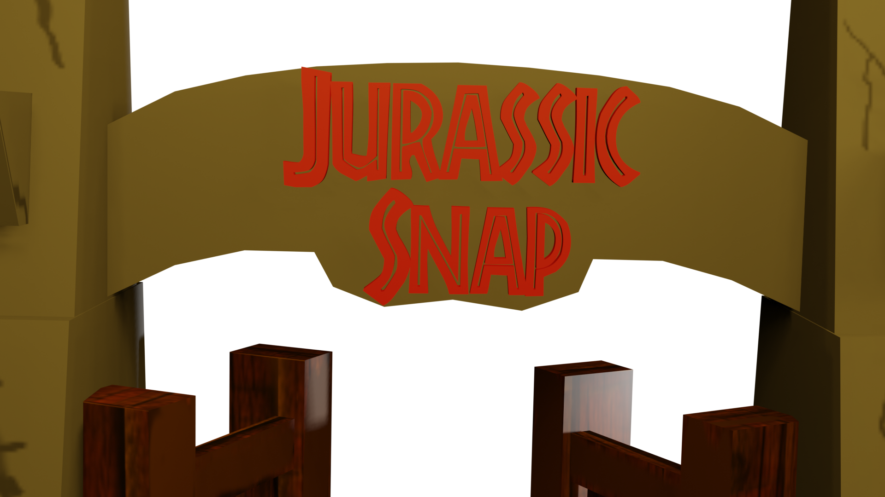

# Computación Gráfica Avanzada  
# Semestre 2020-2



 Repositorio de **Computación gráfica avanzada** para el semestre **2020-2** en el apartado del código de proyecto, **UNAM-2020**.

En este repositorio se encuentran los archivos del código del proyecto final, al cual se le denominó 'Jurassic Snap'. Éste documento también contiene los lineamientos del proyecto.

**Profesor de la asignatura:**

Reynaldo Martell Ávila [(GITHUB)](https://github.com/rmartella)

**Integrantes del Proyecto:**

-Barrera Bernal Rodrigo Adalberto [(GITHUB)](https://github.com/rockbarrera)

-Ochoa Ríos Luis Ernesto [(GITHUB)](https://github.com/Leor8a)

Resumen de la estructura de archivos:


```bash

├── ProyectoCGA_2020_2 - Repositorio del código para el proyecto 'Jurassic Snap'.
│   ├── 14-OpenAL - Contiene el main del programa, por lo general todos los cambios importantes 
|   |   se dieron en éste archivo.
│   ├── CGALib - Es el core de la aplicación, en éste proyecto se genera una biblioteca dinámica 
|   |   para que el main pueda utilizar las clases y por ende podamos hacer instancias de Modelos, 
|   |   llamar a cargar texturas, manejar el tiempo en la aplicación , étc.
│   ├── Jurassic_Photos - Carpeta que alberga las fotos que se toman dentro del juego.
│   ├── Shaders - Fragment Shaders y Vertex Shaders están contenidos en esta carpeta.
│   ├── Textures - Texturas para el suelo y algunas otras cosas, también para las partículas.
│   ├── animaciones - Animación por keyframes //Ver si se elimina
│   ├── dlls - Todas las bibliotecas dinámicas del proyecto.
│   ├── external - Son los archivos necesarios para la integración del proyecto, bibliotecas de terceros.
│   ├── models - Los modelos y animaciones de modelos usados en el proyecto.
│   └── sounds - Sonidos del proyecto.
│   └── README.md - Archivo que contiene indicaciones para la instalación del programa.
├── ComputacionGraficaAvanzada.sln - Archivo solución del proyecto para Microsoft Visual Studio 2017/2019
├── MapadeLocalizaciones.jpeg - Despliegue de elementos en el escenario tridimensional / Boceto
├── README.md **(Archivo que ahora observas)
└── .gitignore - Limpieza de carpetas y archivos del repositorio 

```

## Lineamientos:

**Descripción general del proyecto y algunos lineamientos:**

El alumno, presentará como proyecto final, un escenario tridimensional. El proyecto se entragará el día **18 de Junio** a la hora de clase, la entrega del proyecto consiste en lo siguiente:


1) El código debe estár concentrado en un repositorio git de un integrante del equipo, el código debe ser lo más compacto posible en un repositorio nuevo. **No debe contener código de las prácticas** 

2) En otro repositorio **toda la documentación** conteniendo en éste:


a. Manual de usuario.

b. Reporte del desarrolo del proyecto
       
       b.1 Introducción.
       b.2 Objetivo del juego (Gameplay).
       b.3 Desarrollo.
       b.4 Resultados y trabajo a futuro.
       b.5 Conclusiones.
       
c. Video del funcionamiento narrado de su juego.

d. Crear los ejecutables


3) Se deberá mostrar el proyecto el día **18 de Junio** a la hora de clase, cada equipo tendrá 5 minutos.


## Ligas de Repositorios:

Repositorio de Proyecto Final [Proyecto Final](https://github.com/rockbarrera/ProyectoCGA_2020_2)

Repositorio que contiene la documentación [Documentación del Proyecto Final](https://github.com/Leor8a/CGA-PF-DOCS)
